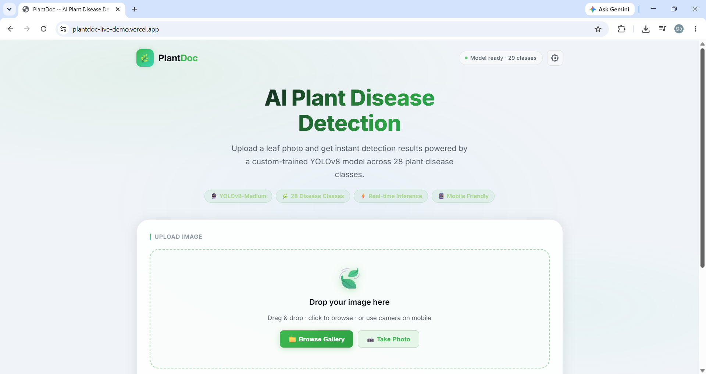
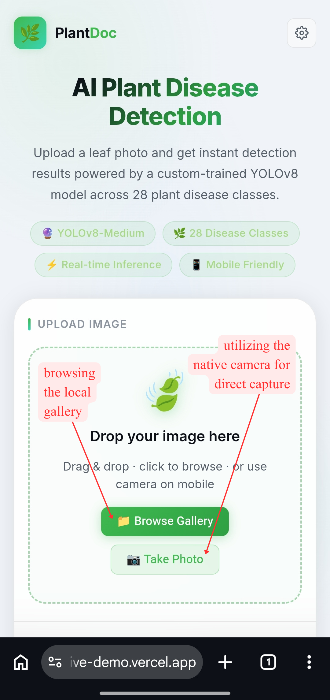
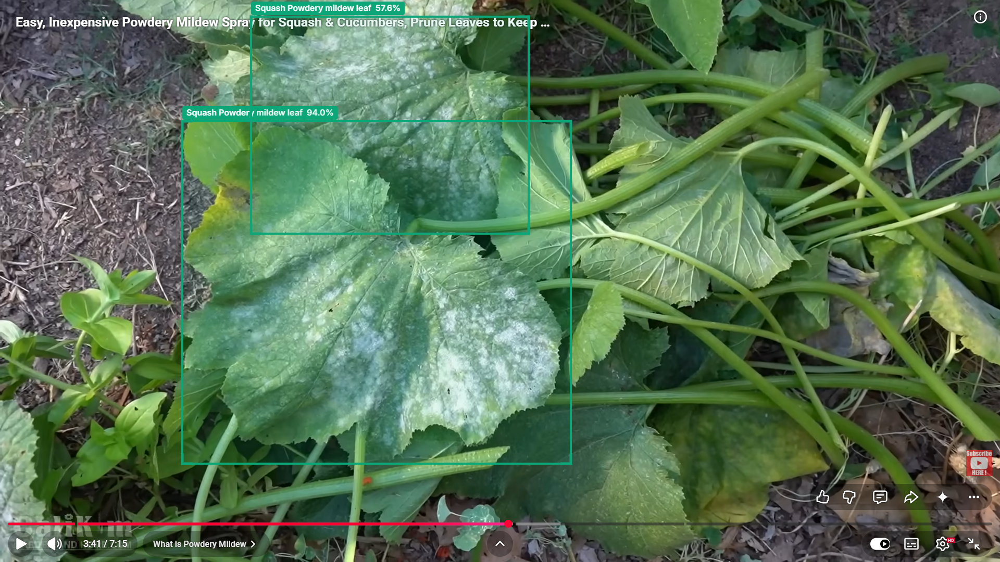

<div align="center">

# 🌿 PlantDoc — AI Plant Disease Detection

**A production-ready, containerized web application for real-time plant disease object detection.**

[](https://python.org)
[](https://fastapi.tiangolo.com)
[](https://ultralytics.com)
[](https://onnxruntime.ai)
[](https://docker.com)
[](LICENSE)
[](https://plantdoc-live-demo.vercel.app)

*University Final Project — Deep Learning*

</div>

---

> **🚀 Live Demo:** [https://plantdoc-live-demo.vercel.app](https://plantdoc-live-demo.vercel.app)

---

## 📸 Overview

PlantDoc is a full-stack web application that lets users upload a leaf photo (or snap one directly from a mobile camera) and instantly receive AI-powered plant disease detections — complete with colour-coded bounding boxes drawn on a canvas.

| Feature | Detail |
|---|---|
| **Model** | YOLO11-Medium, exported to ONNX |
| **Classes** | 29 plant disease categories |
| **Backend** | FastAPI + ONNX Runtime (CPU) |
| **Frontend** | Vanilla HTML / CSS / JS, single-page app |
| **Deployment** | Docker (multi-stage) · Render.com · Railway.app |
| **Responsive** | ✅ Mobile-first — works on phone & laptop |

---

## 🖥️ Screenshots

### Desktop Interface



---

## 📱 How to Use

PlantDoc works seamlessly on both desktop and mobile. On mobile, two primary action buttons guide the user:

<div align="center">
  
</div>

| Button | Action |
|---|---|
| **Browse Gallery** | Open your device's photo library and select an existing leaf image |
| **Take Photo** | Launch the rear camera to snap a fresh photo of a plant leaf |

Once an image is selected, the AI model runs automatically and draws colour-coded bounding boxes with disease labels over the detected regions.

---

## 🔬 Demo — Squash Powdery Mildew Detection

The image below shows a sample inference result on a **Squash Powdery Mildew** leaf. The model correctly identifies and localises the diseased area with a high-confidence bounding box.



---

## 🗂️ Project Structure

```
plantdoc-live-demo/
│
├── assets/
│   ├── best.onnx          # YOLO11-Medium ONNX model (1×3×640×640 → 1×84×8400)
│   ├── labels.json        # 29 class names
│   └── images/            # Screenshots & demo images for documentation
│       ├── ui_laptop.png  # Desktop browser screenshot
│       ├── ui_buttons.png # Mobile UI guide (Browse Gallery / Take Photo)
│       └── demo_squash.png# Sample inference result — Squash Powdery Mildew
│
├── static/                # Served as the root (/) by FastAPI StaticFiles
│   ├── index.html         # Single-page application shell
│   ├── css/
│   │   └── style.css      # Design tokens, layout, components, responsive
│   └── js/
│       └── app.js         # API calls, canvas rendering, drag-drop, UI state
│
├── training/              # Model training pipeline & outputs (reference only)
│   ├── plant-disease-detection.ipynb  # Google Colab training notebook
│   ├── labels.json        # 29-class label index
│   ├── README.md          # Training details & reproduction guide
│   └── plantdoc_yolo/     # YOLO training run artefacts (curves, metrics, previews)
│       └── weights/       # best.pt, last.pt, best.onnx (PyTorch & ONNX checkpoints)
│
├── main.py                # FastAPI app — preprocessing, inference, postprocessing
├── requirements.txt       # Pinned Python dependencies
├── Dockerfile             # Multi-stage optimised Docker image
├── docker-compose.yml     # Local development & production orchestration
├── .dockerignore          # Lean Docker build context
└── .gitignore             # Standard Python / Docker ignores
```

---

## 🧠 Disease Classes

The model detects **29 plant disease conditions** across 10 crops:

| # | Class | # | Class |
|---|---|---|---|
| 0 | Apple Scab Leaf | 14 | Soyabean leaf |
| 1 | Apple leaf | 15 | Squash Powdery mildew leaf |
| 2 | Apple rust leaf | 16 | Strawberry leaf |
| 3 | Bell_pepper leaf | 17 | Tomato Early blight leaf |
| 4 | Bell_pepper leaf spot | 18 | Tomato Septoria leaf spot |
| 5 | Blueberry leaf | 19 | Tomato leaf |
| 6 | Cherry leaf | 20 | Tomato leaf bacterial spot |
| 7 | Corn Gray leaf spot | 21 | Tomato leaf late blight |
| 8 | Corn leaf blight | 22 | Tomato leaf mosaic virus |
| 9 | Corn rust leaf | 23 | Tomato leaf yellow virus |
| 10 | Peach leaf | 24 | Tomato mold leaf |
| 11 | Potato leaf early blight | 25 | Tomato two spotted spider mites leaf |
| 12 | Potato leaf late blight | 26 | grape leaf |
| 13 | Raspberry leaf | 27 | grape leaf black rot |

---

## 📂 Dataset

[](https://github.com/dovh11/PlantDoc-Object-Detection-Dataset)

The model was trained on a forked and prepared version of the **PlantDoc Object Detection Dataset**, converted to YOLO format and hosted on GitHub for direct use with Ultralytics:

> 🔗 **[github.com/dovh11/PlantDoc-Object-Detection-Dataset](https://github.com/dovh11/PlantDoc-Object-Detection-Dataset)**

| Property | Value |
|---|---|
| **Format** | YOLO (images + labels) |
| **Classes** | 29 plant disease categories |
| **Source** | Forked & prepared from the original PlantDoc dataset |
| **Usage** | Loaded directly into the training notebook via the GitHub URL |

See [`training/plant-disease-detection.ipynb`](training/plant-disease-detection.ipynb) for how the dataset is fetched and used during training.

---

## 🚀 Quick Start

### Prerequisites

- [Docker](https://docs.docker.com/get-docker/) ≥ 24.x
- [Docker Compose](https://docs.docker.com/compose/install/) ≥ 2.x

### Run Locally with Docker

```bash
# 1. Clone the repository
git clone https://github.com/dovh11/plantdoc-live-demo.git
cd plantdoc-live-demo

# 2. Build the Docker image
docker compose build

# 3. Start the container
docker compose up

# 4. Open in your browser
open http://localhost:8000
```

The app is ready when you see:
```
🌱 PlantDoc inference engine is live!
INFO:     Application startup complete.
```

### Run without Docker (development)

```bash
# Create a virtual environment
python -m venv venv
source venv/bin/activate          # Windows: venv\Scripts\activate

# Install dependencies
pip install -r requirements.txt

# Start the dev server
python main.py
# → http://localhost:8000
```

---

## 🔌 API Reference

### `GET /health`
Liveness probe. Used by Docker HEALTHCHECK and cloud load-balancers.

```json
{
  "status": "ok",
  "model_ready": true,
  "num_classes": 29,
  "labels_count": 29
}
```

### `POST /predict`
Run YOLO11 inference on an uploaded image.

**Request** — `multipart/form-data`

| Field | Type | Description |
|---|---|---|
| `file` | `File` | Plant leaf image (JPEG / PNG / WebP) |
| `threshold` | `float` | Confidence threshold, `0.01–0.95` (default: `0.25`) |

**Response** — `application/json`

```json
[
  {
    "class":      "Apple Scab Leaf",
    "class_id":   0,
    "confidence": 0.8731,
    "box":        [142, 58, 490, 412]
  },
  {
    "class":      "Apple rust leaf",
    "class_id":   2,
    "confidence": 0.6102,
    "box":        [20, 10, 200, 180]
  }
]
```

`box` is `[xmin, ymin, xmax, ymax]` in the **original image's pixel coordinates**.

---

## 🏗️ Architecture

```
Mobile / Desktop Browser
        │
        │  GET /          → index.html (StaticFiles)
        │  GET /css/style.css
        │  GET /js/app.js
        │  POST /predict  → multipart (image + threshold)
        │
        ▼
   FastAPI (uvicorn)
        │
        ├─ Letterbox resize (640×640, preserve aspect ratio)
        ├─ BGR→RGB, /255 normalise, HWC→NCHW float32
        │
        ▼
   ONNX Runtime (CPU)
   best.onnx [1,3,640,640] → [1,84,8400]
        │
        ├─ Transpose → [8400, 84]
        ├─ Per-anchor: argmax class scores, confidence filter
        ├─ De-letterbox → original pixel coordinates
        └─ cv2.dnn.NMSBoxes (IoU = 0.45)
        │
        ▼
   JSON detections → Canvas bounding-box renderer
```

### Inference Pipeline

| Stage | Description |
|---|---|
| **Letterbox** | Resize to 640×640 maintaining aspect ratio with grey padding |
| **Normalise** | Convert uint8 → float32, divide by 255 |
| **NCHW** | Transpose HWC → `[1, 3, 640, 640]` for ONNX |
| **Inference** | ONNX Runtime CPU, all graph optimisations enabled |
| **Decode** | Transpose output `[1,84,8400]` → `[8400,84]`; extract cx,cy,w,h + class scores |
| **De-letterbox** | Remove pad offset, divide by scale → original pixel coords |
| **NMS** | `cv2.dnn.NMSBoxes`, IoU threshold 0.45 |

---

## 🎨 Frontend Features

| Feature | Implementation |
|---|---|
| **Dark glassmorphism UI** | `backdrop-filter: blur(24px)` + CSS custom properties |
| **Drag & drop** | `dragenter/dragover/drop` events with visual highlight |
| **Mobile camera** | `<input capture="environment">` — native camera on iOS & Android |
| **Canvas rendering** | `createImageBitmap` → `drawImage` → bounding box + label pills |
| **L-corner accents** | Modern detection box style with corner highlights |
| **29-color palette** | Deterministic color per `class_id` |
| **Confidence bar** | Animated CSS fill per detection card |
| **Live status badge** | Polls `/health`; shows model-ready indicator |
| **Accessibility** | `role`, `aria-label`, `aria-live`, keyboard navigation |

---

## 🐳 Docker Details

The Dockerfile uses a **multi-stage build**:

1. **Builder stage** — installs Python packages with gcc/g++ into an isolated prefix
2. **Runtime stage** — copies only the compiled packages (no build tools in final image)

| Property | Value |
|---|---|
| Base image | `python:3.11-slim` |
| Final image size | ~600 MB (dominated by onnxruntime + opencv) |
| Exposed port | `8000` |
| User | `appuser` (non-root, UID 1001) |
| Health check | `GET /health` every 30s |

---

## ☁️ Cloud Deployment

### Render.com (Free Tier)

1. Push to GitHub
2. [render.com](https://render.com) → **New Web Service** → connect repo
3. Runtime: **Docker** · Health Check Path: `/health`
4. Click **Deploy** → get a public `https://` URL

> **Note:** Free tier sleeps after 15 min idle (cold start ~30s). Upgrade to Starter ($7/mo) for always-on.

### Railway.app

```bash
npm install -g @railway/cli
railway login
railway init
railway up
```

> Add `PORT` environment variable support in Railway dashboard → **Settings → Networking → Port: 8000**.

---

## 📦 Dependencies

| Package | Version | Purpose |
|---|---|---|
| `fastapi` | 0.111.0 | Web framework |
| `uvicorn[standard]` | 0.30.1 | ASGI server (uvloop + httptools) |
| `python-multipart` | 0.0.9 | `multipart/form-data` file uploads |
| `onnxruntime` | 1.18.0 | ONNX model inference (CPU) |
| `opencv-python-headless` | 4.9.0.80 | Image decoding, NMS, letterbox |
| `numpy` | 1.26.4 | Array manipulation |
| `Pillow` | 10.3.0 | Image utility |

---

## 🔧 Environment Variables

| Variable | Default | Description |
|---|---|---|
| `PYTHONUNBUFFERED` | `1` | Unbuffered stdout/stderr logging |
| `PYTHONDONTWRITEBYTECODE` | `1` | No `.pyc` files in container |

---

## 📝 License

This project is licensed under the **MIT License** — see [LICENSE](LICENSE) for details.

---

<div align="center">

Made with 🌱 for my university final project.

**[FastAPI](https://fastapi.tiangolo.com) · [ONNX Runtime](https://onnxruntime.ai) · [YOLOv8](https://ultralytics.com) · [Docker](https://docker.com)**

</div>
